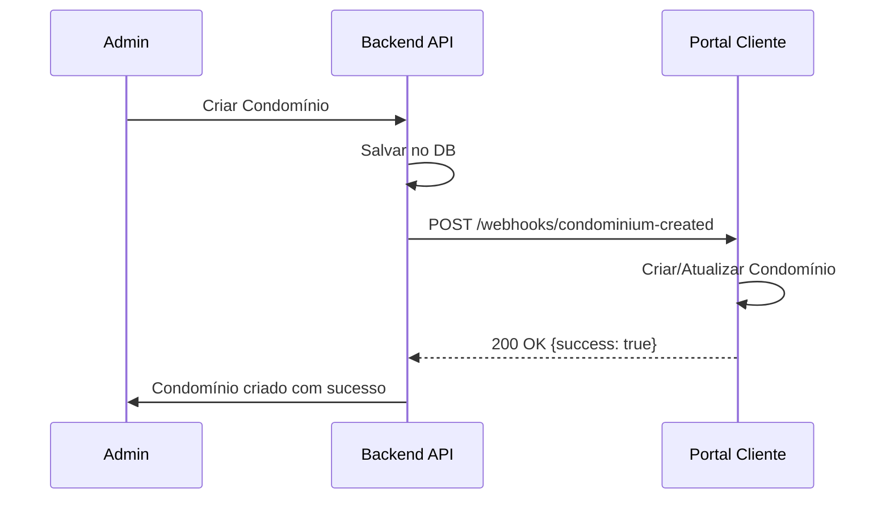
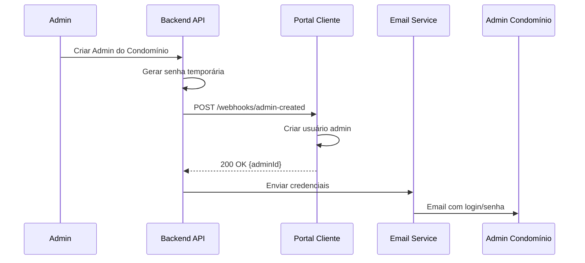
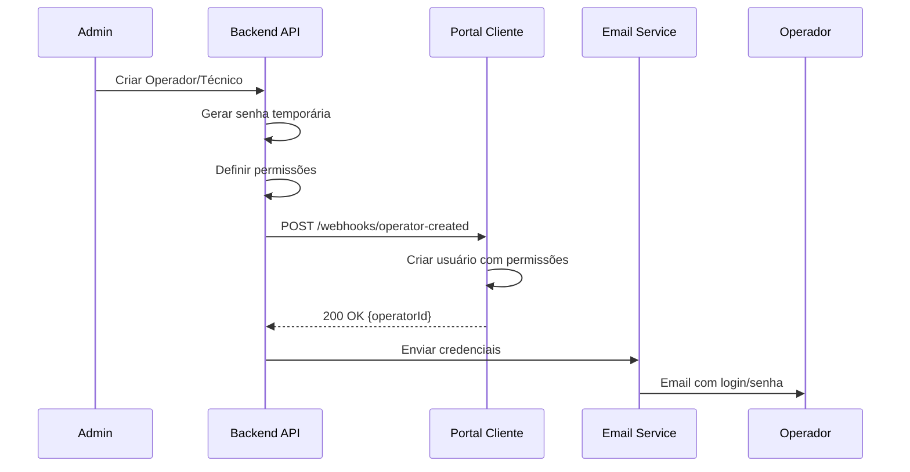
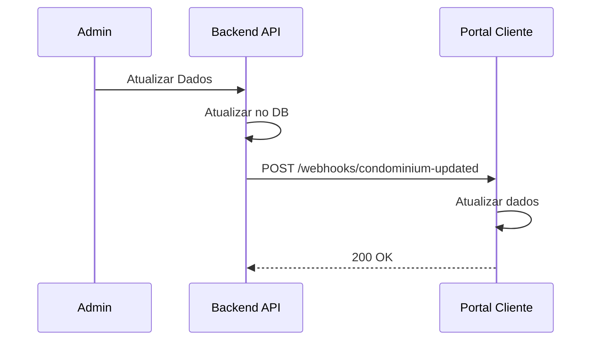
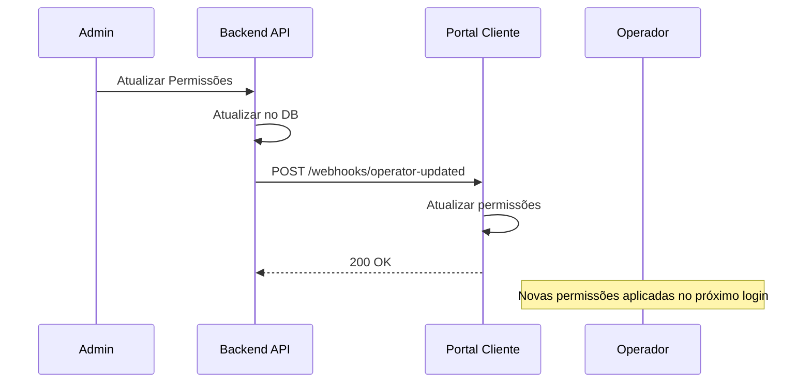

# 🔗 Documentação de Integração - Portal Cliente & Backend API

## 📋 Visão Geral

Este documento descreve a integração entre dois sistemas:

- **Backend API** (Sistema Principal): Gerenciamento administrativo de condomínios, usuários e recursos
- **Portal Cliente** (vigiae-remote-concierge): Portal de autoatendimento para moradores e administradores de condomínios

## 🏗️ Arquitetura da Integração

```
┌─────────────────────────┐         Webhooks          ┌──────────────────────────┐
│                         │    ───────────────────>   │                          │
│    Backend API          │                           │   Portal Cliente         │
│  (Sistema Principal)    │    <───────────────────   │  (vigiae-remote-         │
│                         │         API Calls         │   concierge)             │
└─────────────────────────┘                           └──────────────────────────┘
         │                                                       │
         │                                                       │
         v                                                       v
┌─────────────────────────┐                           ┌──────────────────────────┐
│  MongoDB Database       │                           │  MongoDB Database        │
│  (mochileiroadmin)      │                           │  (portal-cliente)        │
└─────────────────────────┘                           └──────────────────────────┘
```

## 🔐 Configuração de Autenticação

### Webhook Secret

Configure o mesmo secret em ambos os sistemas:

**Backend API (.env):**
```bash
PORTAL_CLIENTE_WEBHOOK_SECRET=webhook-secret-portal-cliente-2025
PORTAL_CLIENTE_URL=http://localhost:9000
```

**Portal Cliente (.env):**
```bash
PORTAL_CLIENTE_WEBHOOK_SECRET=webhook-secret-portal-cliente-2025
```

## 📡 Webhooks - Backend API → Portal Cliente

O Backend API deve enviar webhooks para o Portal Cliente quando houver mudanças em condomínios e usuários administrativos.

### Base URL
```
POST http://localhost:9000/api/portal-cliente/webhooks
```

### Headers Obrigatórios
```http
Content-Type: application/json
x-webhook-secret: webhook-secret-portal-cliente-2025
```

---

### 1️⃣ Webhook: Condomínio Criado

**Endpoint:** `POST /api/portal-cliente/webhooks/condominium-created`

**Quando Disparar:** Após criar um novo condomínio no Backend API

**Payload:**
```json
{
  "condominiumId": "60d21b4667d0d8992e610c85",
  "name": "Condomínio Residencial Vista Alegre",
  "taxId": "12.345.678/0001-90",
  "address": "Rua das Flores, 123 - Bairro Jardim",
  "phone": "(11) 98765-4321",
  "email": "contato@condominio.com.br",
  "settings": {
    "requireVisitorApproval": false,
    "invitationLinkEnabled": true,
    "qrCodeEnabled": true
  },
  "limits": {
    "residents": 500,
    "visitors": 1000,
    "vehicles": 500
  }
}
```

**Resposta Sucesso:**
```json
{
  "success": true,
  "condominiumId": "60d21b4667d0d8992e610c85"
}
```

**Exemplo de Código (Backend API - Node.js):**
```javascript
const axios = require('axios');

async function notificarCondominioCriado(condominio) {
  try {
    const response = await axios.post(
      'http://localhost:9000/api/portal-cliente/webhooks/condominium-created',
      {
        condominiumId: condominio._id.toString(),
        name: condominio.nome,
        taxId: condominio.cnpj,
        address: condominio.endereco,
        phone: condominio.telefone,
        email: condominio.email,
        settings: condominio.configuracoes,
        limits: condominio.limites
      },
      {
        headers: {
          'Content-Type': 'application/json',
          'x-webhook-secret': process.env.PORTAL_CLIENTE_WEBHOOK_SECRET
        }
      }
    );
    
    console.log('Condomínio sincronizado:', response.data);
    return response.data;
  } catch (error) {
    console.error('Erro ao sincronizar condomínio:', error.message);
    throw error;
  }
}
```

---

### 2️⃣ Webhook: Condomínio Atualizado

**Endpoint:** `POST /api/portal-cliente/webhooks/condominium-updated`

**Quando Disparar:** Após atualizar dados de um condomínio no Backend API

**Payload:** (mesmo formato do webhook de criação)

**Exemplo de Código:**
```javascript
async function notificarCondominioAtualizado(condominio) {
  try {
    const response = await axios.post(
      'http://localhost:9000/api/portal-cliente/webhooks/condominium-updated',
      {
        condominiumId: condominio._id.toString(),
        name: condominio.nome,
        taxId: condominio.cnpj,
        address: condominio.endereco,
        phone: condominio.telefone,
        email: condominio.email,
        settings: condominio.configuracoes,
        limits: condominio.limites
      },
      {
        headers: {
          'Content-Type': 'application/json',
          'x-webhook-secret': process.env.PORTAL_CLIENTE_WEBHOOK_SECRET
        }
      }
    );
    
    return response.data;
  } catch (error) {
    console.error('Erro ao atualizar condomínio:', error.message);
    throw error;
  }
}
```

---

### 3️⃣ Webhook: Condomínio Desativado

**Endpoint:** `POST /api/portal-cliente/webhooks/condominium-deactivated`

**Quando Disparar:** Após desativar/suspender um condomínio no Backend API

**Payload:**
```json
{
  "condominiumId": "60d21b4667d0d8992e610c85"
}
```

**Resposta Sucesso:**
```json
{
  "success": true
}
```

**Exemplo de Código:**
```javascript
async function notificarCondominioDesativado(condominioId) {
  try {
    const response = await axios.post(
      'http://localhost:9000/api/portal-cliente/webhooks/condominium-deactivated',
      {
        condominiumId: condominioId.toString()
      },
      {
        headers: {
          'Content-Type': 'application/json',
          'x-webhook-secret': process.env.PORTAL_CLIENTE_WEBHOOK_SECRET
        }
      }
    );
    
    return response.data;
  } catch (error) {
    console.error('Erro ao desativar condomínio:', error.message);
    throw error;
  }
}
```

---

### 4️⃣ Webhook: Admin Criado

**Endpoint:** `POST /api/portal-cliente/webhooks/admin-created`

**Quando Disparar:** Após criar um usuário administrador de condomínio no Backend API

**Payload:**
```json
{
  "condominiumId": "60d21b4667d0d8992e610c85",
  "name": "João Silva",
  "email": "joao.silva@condominio.com.br",
  "temporaryPassword": "Admin@2025!Temp",
  "needsPasswordChange": true
}
```

**Resposta Sucesso:**
```json
{
  "success": true,
  "adminId": "60d21b4667d0d8992e610c99"
}
```

**Exemplo de Código:**
```javascript
async function notificarAdminCriado(admin, condominioId) {
  try {
    // Gerar senha temporária
    const senhaTemporaria = gerarSenhaTemporaria();
    
    const response = await axios.post(
      'http://localhost:9000/api/portal-cliente/webhooks/admin-created',
      {
        condominiumId: condominioId.toString(),
        name: admin.nome,
        email: admin.email,
        temporaryPassword: senhaTemporaria,
        needsPasswordChange: true
      },
      {
        headers: {
          'Content-Type': 'application/json',
          'x-webhook-secret': process.env.PORTAL_CLIENTE_WEBHOOK_SECRET
        }
      }
    );
    
    // Enviar email com credenciais ao admin
    await enviarEmailCredenciais(admin.email, senhaTemporaria);
    
    return response.data;
  } catch (error) {
    console.error('Erro ao criar admin:', error.message);
    throw error;
  }
}

function gerarSenhaTemporaria() {
  const chars = 'ABCDEFGHJKLMNPQRSTUVWXYZabcdefghijkmnpqrstuvwxyz23456789!@#$%';
  let senha = '';
  for (let i = 0; i < 12; i++) {
    senha += chars.charAt(Math.floor(Math.random() * chars.length));
  }
  return senha;
}
```

---

### 5️⃣ Webhook: Operador/Técnico Criado

**Endpoint:** `POST /api/portal-cliente/webhooks/operator-created`

**Quando Disparar:** Após criar um operador ou técnico no Backend API

**Payload:**
```json
{
  "condominiumId": "60d21b4667d0d8992e610c85",
  "name": "Carlos Oliveira",
  "email": "carlos.oliveira@empresa.com.br",
  "userType": "operator",
  "temporaryPassword": "Operator@2025!Temp",
  "needsPasswordChange": true,
  "permissions": {
    "canViewAllCondominiums": false,
    "canManageVisitors": true,
    "canManageVehicles": true,
    "canViewReports": false,
    "canManageAccess": true
  },
  "assignedCondominiums": [
    "60d21b4667d0d8992e610c85",
    "60d21b4667d0d8992e610c86"
  ]
}
```

**Campos:**
- `userType`: "operator" | "technician"
- `permissions`: Objeto com permissões granulares
  - `canViewAllCondominiums`: Ver dados de todos os condomínios (apenas para supervisores)
  - `canManageVisitors`: Gerenciar visitantes
  - `canManageVehicles`: Gerenciar veículos
  - `canViewReports`: Visualizar relatórios
  - `canManageAccess`: Controlar acessos e portaria
- `assignedCondominiums`: Array de IDs dos condomínios que o operador pode acessar

**Resposta Sucesso:**
```json
{
  "success": true,
  "operatorId": "60d21b4667d0d8992e610c99"
}
```

**Exemplo de Código:**
```javascript
async function notificarOperadorCriado(operador, condominiosAtribuidos) {
  try {
    // Gerar senha temporária
    const senhaTemporaria = gerarSenhaTemporaria();
    
    const response = await axios.post(
      'http://localhost:9000/api/portal-cliente/webhooks/operator-created',
      {
        condominiumId: operador.condominiumId.toString(),
        name: operador.nome,
        email: operador.email,
        userType: operador.tipo, // 'operator' ou 'technician'
        temporaryPassword: senhaTemporaria,
        needsPasswordChange: true,
        permissions: {
          canViewAllCondominiums: operador.permissoes.verTodosCondominios || false,
          canManageVisitors: operador.permissoes.gerenciarVisitantes || true,
          canManageVehicles: operador.permissoes.gerenciarVeiculos || true,
          canViewReports: operador.permissoes.verRelatorios || false,
          canManageAccess: operador.permissoes.gerenciarAcessos || true
        },
        assignedCondominiums: condominiosAtribuidos.map(c => c.toString())
      },
      {
        headers: {
          'Content-Type': 'application/json',
          'x-webhook-secret': process.env.PORTAL_CLIENTE_WEBHOOK_SECRET
        }
      }
    );
    
    // Enviar email com credenciais ao operador
    await enviarEmailCredenciais(operador.email, senhaTemporaria);
    
    return response.data;
  } catch (error) {
    console.error('Erro ao criar operador:', error.message);
    throw error;
  }
}
```

---

### 6️⃣ Webhook: Operador/Técnico Atualizado

**Endpoint:** `POST /api/portal-cliente/webhooks/operator-updated`

**Quando Disparar:** Após atualizar permissões ou condomínios atribuídos de um operador/técnico

**Payload:**
```json
{
  "condominiumId": "60d21b4667d0d8992e610c85",
  "email": "carlos.oliveira@empresa.com.br",
  "name": "Carlos Oliveira Silva",
  "userType": "operator",
  "permissions": {
    "canViewAllCondominiums": false,
    "canManageVisitors": true,
    "canManageVehicles": true,
    "canViewReports": true,
    "canManageAccess": true
  },
  "assignedCondominiums": [
    "60d21b4667d0d8992e610c85",
    "60d21b4667d0d8992e610c86",
    "60d21b4667d0d8992e610c87"
  ]
}
```

**Resposta Sucesso:**
```json
{
  "success": true,
  "operatorId": "60d21b4667d0d8992e610c99"
}
```

**Exemplo de Código:**
```javascript
async function notificarOperadorAtualizado(operador, condominiosAtribuidos) {
  try {
    const response = await axios.post(
      'http://localhost:9000/api/portal-cliente/webhooks/operator-updated',
      {
        condominiumId: operador.condominiumId.toString(),
        email: operador.email,
        name: operador.nome,
        userType: operador.tipo,
        permissions: {
          canViewAllCondominiums: operador.permissoes.verTodosCondominios || false,
          canManageVisitors: operador.permissoes.gerenciarVisitantes || true,
          canManageVehicles: operador.permissoes.gerenciarVeiculos || true,
          canViewReports: operador.permissoes.verRelatorios || false,
          canManageAccess: operador.permissoes.gerenciarAcessos || true
        },
        assignedCondominiums: condominiosAtribuidos.map(c => c.toString())
      },
      {
        headers: {
          'Content-Type': 'application/json',
          'x-webhook-secret': process.env.PORTAL_CLIENTE_WEBHOOK_SECRET
        }
      }
    );
    
    return response.data;
  } catch (error) {
    console.error('Erro ao atualizar operador:', error.message);
    throw error;
  }
}
```

---

### 7️⃣ Webhook: Operador/Técnico Desativado

**Endpoint:** `POST /api/portal-cliente/webhooks/operator-deactivated`

**Quando Disparar:** Após desativar ou remover um operador/técnico no Backend API

**Payload:**
```json
{
  "email": "carlos.oliveira@empresa.com.br",
  "condominiumId": "60d21b4667d0d8992e610c85"
}
```

**Resposta Sucesso:**
```json
{
  "success": true
}
```

**Exemplo de Código:**
```javascript
async function notificarOperadorDesativado(operador) {
  try {
    const response = await axios.post(
      'http://localhost:9000/api/portal-cliente/webhooks/operator-deactivated',
      {
        email: operador.email,
        condominiumId: operador.condominiumId.toString()
      },
      {
        headers: {
          'Content-Type': 'application/json',
          'x-webhook-secret': process.env.PORTAL_CLIENTE_WEBHOOK_SECRET
        }
      }
    );
    
    return response.data;
  } catch (error) {
    console.error('Erro ao desativar operador:', error.message);
    throw error;
  }
}
```

---

## 🔄 Fluxo de Integração Completo

### Cenário 1: Novo Condomínio



### Cenário 2: Criar Admin do Condomínio



### Cenário 3: Criar Operador/Técnico



### Cenário 4: Atualizar Condomínio



### Cenário 5: Atualizar Permissões de Operador



---

## 🛠️ Implementação no Backend API

### 1. Criar Service de Webhooks

**Arquivo:** `src/services/portal-cliente-webhook.service.js`

```javascript
const axios = require('axios');
const config = require('../config');

class PortalClienteWebhookService {
  constructor() {
    this.baseUrl = config.portalCliente.url;
    this.secret = config.portalCliente.webhookSecret;
  }

  async enviarWebhook(endpoint, data) {
    try {
      const url = `${this.baseUrl}/api/portal-cliente/webhooks/${endpoint}`;
      
      const response = await axios.post(url, data, {
        headers: {
          'Content-Type': 'application/json',
          'x-webhook-secret': this.secret
        },
        timeout: 10000
      });

      console.log(`Webhook ${endpoint} enviado com sucesso:`, response.data);
      return response.data;
    } catch (error) {
      console.error(`Erro ao enviar webhook ${endpoint}:`, error.message);
      
      // Implementar retry ou fila para falhas críticas
      if (error.response) {
        console.error('Response status:', error.response.status);
        console.error('Response data:', error.response.data);
      }
      
      throw error;
    }
  }

  async condominioCriado(condominio) {
    return this.enviarWebhook('condominium-created', {
      condominiumId: condominio._id.toString(),
      name: condominio.nome,
      taxId: condominio.cnpj,
      address: condominio.endereco,
      phone: condominio.telefone,
      email: condominio.email,
      settings: condominio.configuracoes,
      limits: condominio.limites
    });
  }

  async condominioAtualizado(condominio) {
    return this.enviarWebhook('condominium-updated', {
      condominiumId: condominio._id.toString(),
      name: condominio.nome,
      taxId: condominio.cnpj,
      address: condominio.endereco,
      phone: condominio.telefone,
      email: condominio.email,
      settings: condominio.configuracoes,
      limits: condominio.limites
    });
  }

  async condominioDesativado(condominioId) {
    return this.enviarWebhook('condominium-deactivated', {
      condominiumId: condominioId.toString()
    });
  }

  async adminCriado(condominioId, admin, senhaTemporaria) {
    return this.enviarWebhook('admin-created', {
      condominiumId: condominioId.toString(),
      name: admin.nome,
      email: admin.email,
      temporaryPassword: senhaTemporaria,
      needsPasswordChange: true
    });
  }

  async operadorCriado(condominioId, operador, senhaTemporaria, condominiosAtribuidos, permissoes) {
    return this.enviarWebhook('operator-created', {
      condominiumId: condominioId.toString(),
      name: operador.nome,
      email: operador.email,
      userType: operador.tipo, // 'operator' ou 'technician'
      temporaryPassword: senhaTemporaria,
      needsPasswordChange: true,
      permissions: {
        canViewAllCondominiums: permissoes.verTodosCondominios || false,
        canManageVisitors: permissoes.gerenciarVisitantes || true,
        canManageVehicles: permissoes.gerenciarVeiculos || true,
        canViewReports: permissoes.verRelatorios || false,
        canManageAccess: permissoes.gerenciarAcessos || true
      },
      assignedCondominiums: condominiosAtribuidos.map(c => c.toString())
    });
  }

  async operadorAtualizado(condominioId, operador, condominiosAtribuidos, permissoes) {
    return this.enviarWebhook('operator-updated', {
      condominiumId: condominioId.toString(),
      email: operador.email,
      name: operador.nome,
      userType: operador.tipo,
      permissions: {
        canViewAllCondominiums: permissoes.verTodosCondominios || false,
        canManageVisitors: permissoes.gerenciarVisitantes || true,
        canManageVehicles: permissoes.gerenciarVeiculos || true,
        canViewReports: permissoes.verRelatorios || false,
        canManageAccess: permissoes.gerenciarAcessos || true
      },
      assignedCondominiums: condominiosAtribuidos.map(c => c.toString())
    });
  }

  async operadorDesativado(email, condominioId) {
    return this.enviarWebhook('operator-deactivated', {
      email: email,
      condominiumId: condominioId.toString()
    });
  }
}

module.exports = new PortalClienteWebhookService();
```

### 2. Integrar nos Controllers

**Exemplo: Condomínio Controller**

```javascript
const Condominio = require('../models/Condominio');
const webhookService = require('../services/portal-cliente-webhook.service');

// Criar condomínio
async function criarCondominio(req, res) {
  try {
    const condominio = new Condominio(req.body);
    await condominio.save();

    // Enviar webhook para Portal Cliente
    try {
      await webhookService.condominioCriado(condominio);
    } catch (webhookError) {
      console.error('Erro no webhook (não crítico):', webhookError.message);
      // Não falhar a requisição por erro no webhook
    }

    res.status(201).json(condominio);
  } catch (error) {
    res.status(500).json({ error: error.message });
  }
}

// Atualizar condomínio
async function atualizarCondominio(req, res) {
  try {
    const condominio = await Condominio.findByIdAndUpdate(
      req.params.id,
      req.body,
      { new: true }
    );

    if (!condominio) {
      return res.status(404).json({ error: 'Condomínio não encontrado' });
    }

    // Enviar webhook
    try {
      await webhookService.condominioAtualizado(condominio);
    } catch (webhookError) {
      console.error('Erro no webhook:', webhookError.message);
    }

    res.json(condominio);
  } catch (error) {
    res.status(500).json({ error: error.message });
  }
}

// Desativar condomínio
async function desativarCondominio(req, res) {
  try {
    const condominio = await Condominio.findByIdAndUpdate(
      req.params.id,
      { ativo: false },
      { new: true }
    );

    if (!condominio) {
      return res.status(404).json({ error: 'Condomínio não encontrado' });
    }

    // Enviar webhook
    try {
      await webhookService.condominioDesativado(condominio._id);
    } catch (webhookError) {
      console.error('Erro no webhook:', webhookError.message);
    }

    res.json({ message: 'Condomínio desativado com sucesso' });
  } catch (error) {
    res.status(500).json({ error: error.message });
  }
}

module.exports = {
  criarCondominio,
  atualizarCondominio,
  desativarCondominio
};
```

---

## 🧪 Testes de Integração

### Testar Webhook com cURL

```bash
# Teste: Condomínio Criado
curl -X POST http://localhost:9000/api/portal-cliente/webhooks/condominium-created \
  -H "Content-Type: application/json" \
  -H "x-webhook-secret: webhook-secret-portal-cliente-2025" \
  -d '{
    "condominiumId": "60d21b4667d0d8992e610c85",
    "name": "Condomínio Teste",
    "taxId": "12.345.678/0001-90",
    "address": "Rua Teste, 123",
    "phone": "(11) 98765-4321",
    "email": "teste@condominio.com"
  }'

# Teste: Admin Criado
curl -X POST http://localhost:9000/api/portal-cliente/webhooks/admin-created \
  -H "Content-Type: application/json" \
  -H "x-webhook-secret: webhook-secret-portal-cliente-2025" \
  -d '{
    "condominiumId": "60d21b4667d0d8992e610c85",
    "name": "Admin Teste",
    "email": "admin@teste.com",
    "temporaryPassword": "Admin@2025!Temp",
    "needsPasswordChange": true
  }'

# Teste: Operador Criado
curl -X POST http://localhost:9000/api/portal-cliente/webhooks/operator-created \
  -H "Content-Type: application/json" \
  -H "x-webhook-secret: webhook-secret-portal-cliente-2025" \
  -d '{
    "condominiumId": "60d21b4667d0d8992e610c85",
    "name": "Operador Teste",
    "email": "operador@teste.com",
    "userType": "operator",
    "temporaryPassword": "Operator@2025!Temp",
    "needsPasswordChange": true,
    "permissions": {
      "canViewAllCondominiums": false,
      "canManageVisitors": true,
      "canManageVehicles": true,
      "canViewReports": false,
      "canManageAccess": true
    },
    "assignedCondominiums": ["60d21b4667d0d8992e610c85"]
  }'

# Teste: Operador Atualizado
curl -X POST http://localhost:9000/api/portal-cliente/webhooks/operator-updated \
  -H "Content-Type: application/json" \
  -H "x-webhook-secret: webhook-secret-portal-cliente-2025" \
  -d '{
    "condominiumId": "60d21b4667d0d8992e610c85",
    "email": "operador@teste.com",
    "name": "Operador Teste Atualizado",
    "userType": "operator",
    "permissions": {
      "canViewAllCondominiums": false,
      "canManageVisitors": true,
      "canManageVehicles": true,
      "canViewReports": true,
      "canManageAccess": true
    },
    "assignedCondominiums": ["60d21b4667d0d8992e610c85", "60d21b4667d0d8992e610c86"]
  }'

# Teste: Operador Desativado
curl -X POST http://localhost:9000/api/portal-cliente/webhooks/operator-deactivated \
  -H "Content-Type: application/json" \
  -H "x-webhook-secret: webhook-secret-portal-cliente-2025" \
  -d '{
    "email": "operador@teste.com",
    "condominiumId": "60d21b4667d0d8992e610c85"
  }'
```

### Testar com Postman

1. Crie uma collection "Portal Cliente Webhooks"
2. Adicione os endpoints de webhook
3. Configure o header `x-webhook-secret`
4. Salve exemplos de payload
5. Execute testes automatizados

---

## ⚠️ Tratamento de Erros

### Códigos de Resposta

| Código | Significado | Ação |
|--------|-------------|------|
| 200 | Sucesso | Webhook processado |
| 401 | Não autorizado | Verificar webhook secret |
| 400 | Dados inválidos | Verificar payload |
| 500 | Erro interno | Verificar logs do Portal Cliente |

### Retry Strategy

Se o webhook falhar, implemente retry com backoff exponencial:

```javascript
async function enviarWebhookComRetry(endpoint, data, maxRetries = 3) {
  let lastError;
  
  for (let attempt = 1; attempt <= maxRetries; attempt++) {
    try {
      return await webhookService.enviarWebhook(endpoint, data);
    } catch (error) {
      lastError = error;
      console.log(`Tentativa ${attempt} falhou, aguardando retry...`);
      
      if (attempt < maxRetries) {
        await sleep(Math.pow(2, attempt) * 1000); // 2s, 4s, 8s
      }
    }
  }
  
  console.error(`Webhook falhou após ${maxRetries} tentativas:`, lastError.message);
  // Enviar para fila de retry ou alertar equipe
  throw lastError;
}

function sleep(ms) {
  return new Promise(resolve => setTimeout(resolve, ms));
}
```

---

## 📊 Monitoramento

### Logs Importantes

**Backend API:**
```javascript
console.log('[WEBHOOK] Enviando condominium-created para Portal Cliente');
console.log('[WEBHOOK] Resposta recebida:', response.data);
console.error('[WEBHOOK] Erro ao enviar webhook:', error.message);
```

**Portal Cliente:**
```javascript
console.log('[WEBHOOK] Recebido: condominium-created');
console.log('[WEBHOOK] Processamento concluído para condominioId:', id);
console.error('[WEBHOOK] Erro no processamento:', error.message);
```

### Métricas a Monitorar

- Taxa de sucesso dos webhooks
- Tempo de resposta
- Número de retries
- Erros por tipo (401, 400, 500)

---

## 🔒 Segurança

### Checklist de Segurança

- ✅ Validar webhook secret em todas as requisições
- ✅ Usar HTTPS em produção
- ✅ Validar dados recebidos (sanitização)
- ✅ Limitar taxa de requisições (rate limiting)
- ✅ Logs de auditoria para todas as operações
- ✅ Timeout nas requisições HTTP
- ✅ Não expor erros internos nas respostas

---

## 📚 Referências

### Endpoints Disponíveis

**Portal Cliente:**
- Swagger: http://localhost:9000/api
- Health Check: http://localhost:9000/health

**Webhooks:**
- `/api/portal-cliente/webhooks/condominium-created`
- `/api/portal-cliente/webhooks/condominium-updated`
- `/api/portal-cliente/webhooks/condominium-deactivated`
- `/api/portal-cliente/webhooks/admin-created`
- `/api/portal-cliente/webhooks/operator-created`
- `/api/portal-cliente/webhooks/operator-updated`
- `/api/portal-cliente/webhooks/operator-deactivated`

### Variáveis de Ambiente

**Backend API:**
```bash
PORTAL_CLIENTE_URL=http://localhost:9000
PORTAL_CLIENTE_WEBHOOK_SECRET=webhook-secret-portal-cliente-2025
```

**Portal Cliente:**
```bash
PORT=9000
PORTAL_CLIENTE_WEBHOOK_SECRET=webhook-secret-portal-cliente-2025
```

---

## 🆘 Troubleshooting

### Webhook não está sendo recebido
1. Verificar se o Portal Cliente está rodando
2. Confirmar que a porta 9000 está acessível
3. Validar o webhook secret em ambos os sistemas
4. Verificar logs de erro no Backend API

### Erro 401 Unauthorized
- O header `x-webhook-secret` está correto?
- O secret está configurado igualmente em ambos os sistemas?

### Erro 400 Bad Request
- Validar estrutura do payload JSON
- Verificar se todos os campos obrigatórios estão presentes
- Conferir tipos de dados (string, boolean, etc)

### Condomínio não aparece no Portal
1. Verificar logs do webhook
2. Confirmar que o webhook retornou 200
3. Verificar se o condominiumId está correto
4. Checar conexão com MongoDB do Portal Cliente

---

## 📞 Suporte

Para dúvidas ou problemas de integração:
- Email: suporte.vigiae@gmail.com
- Documentação API: http://localhost:9000/api

---

**Última atualização:** 30/12/2025
**Versão:** 2.0 - Adicionado suporte para operadores e técnicos
