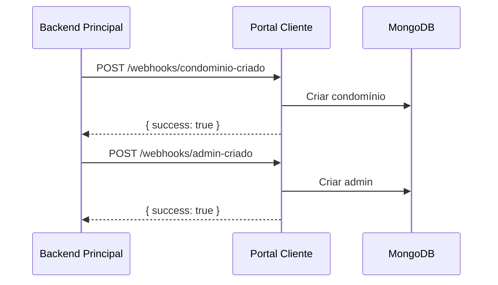

# 🏢 Portal do Cliente - Backend (Portaria Remota)

## 📋 Visão Geral

Backend modular e isolado para o **Portal do Cliente (Portaria Remota)** que permite que condomínios e moradores gerenciem visitantes, veículos e acessos de forma autônoma.

> **⚠️ Arquitetura Modular**  
> Este módulo foi construído de forma completamente isolada para facilitar sua futura extração como microserviço independente.

## 🏗️ Arquitetura

### Separação de Backends

```
┌─────────────────────────────────────────┐
│  BACKEND PRINCIPAL (Admin)              │
│  - Super Admins, Operadores             │
│  - Gestão de Equipamentos               │
└─────────────────────────────────────────┘
                    │
                    │ API REST / Webhooks
                    ▼
┌─────────────────────────────────────────┐
│  BACKEND PORTAL DO CLIENTE (este)       │
│  - Admins de Condomínio                 │
│  - Moradores, Visitantes, Veículos      │
└─────────────────────────────────────────┘
```

### Hierarquia de Usuários

1. **Admin (Condomínio)**
   - Gerencia moradores do condomínio
   - Acessa estatísticas completas
   - Visualiza histórico de acessos

2. **Morador**
   - Cadastra visitantes e veículos
   - Gera links de convite
   - Visualiza próprio histórico

## 🚀 Instalação

### Pré-requisitos

- Node.js >= 18.x
- MongoDB >= 6.x
- npm ou yarn

### Instalação de Dependências

```bash
npm install
```

### Configuração

1. Copie o arquivo `.env.example` para `.env`:

```bash
cp .env.example .env
```

2. Configure as variáveis de ambiente:

```env
# MongoDB
PORTAL_CLIENTE_MONGO_URI=mongodb://localhost:27017/portal-cliente

# JWT
PORTAL_CLIENTE_JWT_SECRET=your-secret-key-here
PORTAL_CLIENTE_JWT_EXPIRES=24h

# Links de Convite
PORTAL_CLIENTE_BASE_URL=http://localhost:3000

# Webhook (comunicação com Backend Principal)
PORTAL_CLIENTE_WEBHOOK_SECRET=shared-secret-with-main-backend
```

## 🏃 Executando

### Desenvolvimento

```bash
npm run start:dev
```

### Produção

```bash
npm run build
npm run start:prod
```

## 📚 Estrutura do Projeto

```
src/modules/portal-cliente/
├── config/                     # Configurações
├── common/                     # Guards, decorators, pipes
│   ├── guards/
│   ├── decorators/
│   ├── pipes/
│   ├── filters/
│   └── interfaces/
├── shared/                     # Utilitários compartilhados
│   ├── constants/
│   └── utils/
├── auth/                       # Autenticação
├── usuarios/                   # Gestão de usuários
├── condominios/                # Gestão de condomínios
├── visitantes/                 # CRUD de visitantes
├── veiculos/                   # CRUD de veículos
├── links-convite/              # Links temporários
├── historico/                  # Histórico de acessos
├── admin/                      # Endpoints admin
├── morador/                    # Endpoints morador
└── notificacoes/               # Serviço de notificações
```

## 🔐 Autenticação

### Login

```http
POST /api/portal-cliente/auth/login
Content-Type: application/json

{
  "email": "usuario@example.com",
  "senha": "senha123",
  "tipoUsuario": "morador"
}
```

**Resposta:**

```json
{
  "token": "eyJhbGciOiJIUzI1NiIs...",
  "usuario": {
    "id": "...",
    "nome": "João Silva",
    "email": "joao@example.com",
    "tipoUsuario": "morador",
    "condominioId": "...",
    "unidade": "Apto 101",
    "codigoAcesso": "MOR-101-..."
  }
}
```

### Uso do Token

Todas as requisições autenticadas devem incluir o header:

```
Authorization: Bearer {token}
```

## 📡 Endpoints Principais

### Morador

- `GET /api/portal-cliente/morador/dashboard` - Dashboard com estatísticas
- `GET /api/portal-cliente/morador/qrcode` - Gerar QR Code de acesso
- `GET /api/portal-cliente/morador/visitantes` - Listar visitantes
- `POST /api/portal-cliente/morador/visitantes` - Cadastrar visitante
- `GET /api/portal-cliente/morador/veiculos` - Listar veículos
- `POST /api/portal-cliente/morador/veiculos` - Cadastrar veículo
- `POST /api/portal-cliente/morador/links-convite` - Gerar link de convite
- `GET /api/portal-cliente/morador/historico` - Histórico de acessos

### Admin

- `GET /api/portal-cliente/admin/dashboard` - Dashboard do condomínio
- `GET /api/portal-cliente/admin/moradores` - Listar moradores
- `POST /api/portal-cliente/admin/moradores` - Cadastrar morador
- `GET /api/portal-cliente/admin/historico` - Histórico completo

### Público (Links de Convite)

- `GET /api/portal-cliente/convite/:token` - Validar link de convite
- `POST /api/portal-cliente/convite/:token/cadastrar` - Cadastrar visitante via link

### Webhooks (Backend Principal)

- `POST /api/portal-cliente/webhooks/condominio-criado` - Notificar novo condomínio
- `POST /api/portal-cliente/webhooks/admin-criado` - Notificar novo admin

## 🔧 Recursos Implementados

### ✅ Funcionalidades

- [x] Autenticação JWT isolada
- [x] Gestão de moradores
- [x] Cadastro de visitantes
- [x] Cadastro de veículos
- [x] Geração de links de convite (expiração 1h)
- [x] Validação de CPF, placas, telefones
- [x] Geração de QR Codes para acesso
- [x] Histórico de acessos
- [x] Dashboard para admin e morador
- [x] Cache de links ativos
- [x] Expiração automática de links (cron)
- [x] Webhooks para integração
- [x] Validação de dados (class-validator)
- [x] Tratamento de erros padronizado

### 🔐 Segurança

- Senhas hasheadas com bcrypt (salt factor 10)
- Tokens JWT com expiração configurável
- Guards de autenticação e autorização
- Validação de webhook secrets
- Sanitização de inputs
- Proteção contra SQL Injection (Mongoose)

## 🧪 Testes

```bash
# Testes unitários
npm run test

# Testes e2e
npm run test:e2e

# Coverage
npm run test:cov
```

## 📦 Extração para Microserviço

Para extrair este módulo como projeto independente:

1. **Copiar pasta do módulo:**
```bash
cp -r src/modules/portal-cliente /path/to/new-project/src
```

2. **Criar novo `package.json`** com dependências necessárias

3. **Criar novo `main.ts`:**
```typescript
import { NestFactory } from '@nestjs/core';
import { PortalClienteModule } from './portal-cliente.module';

async function bootstrap() {
  const app = await NestFactory.create(PortalClienteModule);
  await app.listen(3000);
}
bootstrap();
```

4. **Ajustar imports** (remover caminhos absolutos)

5. **Configurar variáveis de ambiente** separadas

## 🔄 Integração com Backend Principal

### Fluxo de Criação de Condomínio



## 📝 Variáveis de Ambiente

| Variável | Descrição | Padrão |
|----------|-----------|--------|
| `PORTAL_CLIENTE_MONGO_URI` | URI do MongoDB | `mongodb://localhost:27017/portal-cliente` |
| `PORTAL_CLIENTE_JWT_SECRET` | Secret para JWT | - |
| `PORTAL_CLIENTE_JWT_EXPIRES` | Expiração do token | `24h` |
| `PORTAL_CLIENTE_LINK_EXPIRACAO` | Expiração link (horas) | `1` |
| `PORTAL_CLIENTE_BASE_URL` | URL base do sistema | `http://localhost:3000` |
| `PORTAL_CLIENTE_WEBHOOK_SECRET` | Secret dos webhooks | - |

## 🛠️ Stack Tecnológica

- **Framework:** NestJS 11.x
- **Database:** MongoDB 6.x
- **ODM:** Mongoose 8.x
- **Autenticação:** JWT + Passport
- **Validação:** class-validator + class-transformer
- **Cache:** @nestjs/cache-manager
- **Agendamento:** @nestjs/schedule
- **QR Codes:** qrcode
- **Senha:** bcrypt

## 📄 Licença

MIT

## 👥 Suporte

Para dúvidas ou sugestões, abra uma issue no repositório.

---

**Desenvolvido com ❤️ usando NestJS**
